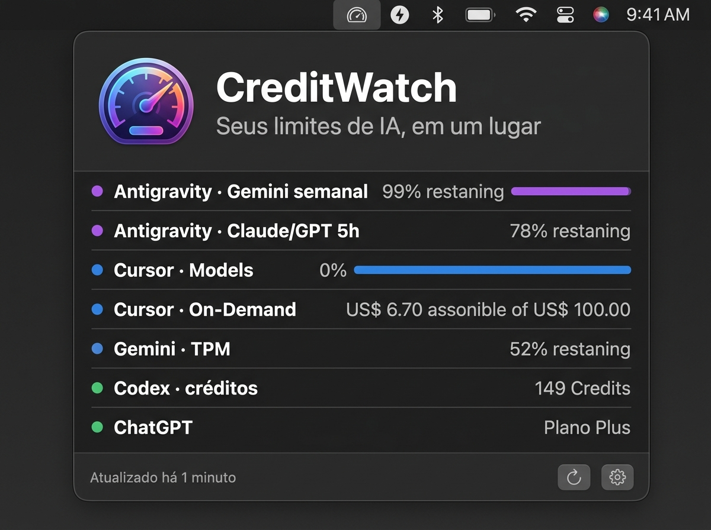
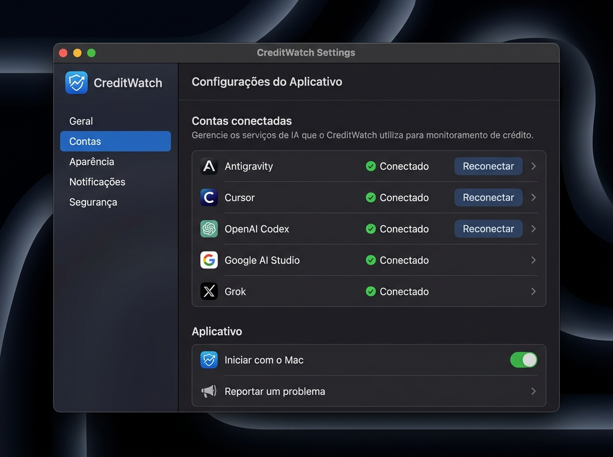

<div align="center">

# ⚡️ CreditWatch

### Monitor em Tempo Real de Créditos e Cotas de IA para macOS

[](https://github.com/pablomichelin/CreditWatch/releases/latest)
[](https://github.com/pablomichelin/CreditWatch)
[](https://github.com/pablomichelin/CreditWatch/releases/latest)
[](https://github.com/pablomichelin/CreditWatch)

<br/>

**Acompanhe seus limites, créditos restantes e datas de renovação do Cursor, Codex, ChatGPT, Claude, Gemini, Antigravity e Grok diretamente da barra de menus.**

<br/>

[📥 **Baixar CreditWatch para macOS (v0.11.7)**](https://github.com/pablomichelin/CreditWatch/releases/latest) • [Instalação](#-instalação) • [Provedores Suportados](#-provedores-suportados) • [Privacidade](#-privacidade-e-segurança)

<br/>

### 📱 Telas do Aplicativo em Funcionamento

<p align="center">
  
  &nbsp;
  
</p>

</div>

---

## 🌟 Principais Recursos

- ⏱️ **Atualização Automática em Tempo Real:** Sincroniza em segundo plano a cada 60 segundos, ao abrir a prévia na barra de menus e ao acordar o Mac.
- 🎯 **Visão Consolidada:** Veja porcentagens restantes, créditos monetários (On-Demand em USD) e horários exatos de reset em um só painel.
- 🔌 **Leitura Local do Antigravity:** Integração nativa de alta performance via RPC local, sem necessidade de login web ou envio de dados externos.
- 🛡️ **100% Privado e Seguro:** Não lê senhas nem cookies de outros navegadores. As sessões ficam salvas exclusivamente no armazenamento seguro nativo do seu Mac (`WKWebsiteDataStore`).
- 🎨 **Design Nativo para macOS:** Interface minimalista, compacta e fluida construída em SwiftUI.

---

## 🤖 Provedores Suportados

| Provedor | Dados e Métricas Monitoradas | Método de Integração |
| :--- | :--- | :--- |
| **Cursor** | Cursor Models (%), Other Models (%), On-Demand ($ restante) e data de renovação | Painel Billing autenticado |
| **OpenAI Codex** | Limite semanal restante (%), saldo de créditos pré-pagos e horário de reset | Painel Usage do Codex |
| **ChatGPT** | Detecção de plano (Plus, Pro, Free) e status de limites | Painel oficial ChatGPT |
| **Claude** | Detecção de plano (Pro, Max, Free) e janela de renovação | Painel Billing / Settings |
| **Google AI Studio** | Quotas dinâmicas RPM *(Req/min)*, TPM *(Tokens/min)* e RPD *(Req/dia)* | Painel Rate Limits do Gemini |
| **Antigravity** | Gemini semanal/5h e Claude/GPT semanal/5h com datas de redefinição | Serviço local via RPC nativo |
| **Grok** | Limite semanal compartilhado dos planos SuperGrok e reset | Painel Settings → Usage |

---

## 🚀 Instalação

### Opção 1: Download Direto (Recomendado)
1. Baixe o pacote zip mais recente em [**Releases**](https://github.com/pablomichelin/CreditWatch/releases/latest);
2. Descompacte o arquivo `CreditWatch-v0.11.7-macOS.zip`;
3. Arraste o **CreditWatch.app** para a sua pasta **Aplicativos**.

### Opção 2: Compilar a partir do Código-Fonte
Requisitos: macOS Sonoma (14.0+) ou superior e ferramentas de linha de comando (`xcode-select --install`).

```bash
git clone https://github.com/pablomichelin/CreditWatch.git
cd CreditWatch
bash Scripts/install.sh
```

---

## 🔒 Privacidade e Segurança Local-First

- **Zero Telemetria:** O CreditWatch não envia dados, métricas ou estatísticas para nenhum servidor externo.
- **Isolamento de Sessão:** Seus logins permanecem exclusivamente no WebKit isolado do sistema no seu próprio Mac.
- **Credenciais Efêmeras:** O token da integração local do Antigravity é consultado em memória e nunca é gravado no disco.
- **Armazenamento Transparente:** Os números coletados são salvos unicamente em `~/Library/Application Support/CreditWatch/usage.json`.

---

## 📦 Versionamento Ativo & Releases Contínuas

O **CreditWatch** segue o padrão de versionamento semântico (*SemVer*) com releases e melhorias frequentes.  
Para consultar o histórico detalhado de todas as versões, veja o arquivo [docs/CHANGELOG.txt](docs/CHANGELOG.txt) e a documentação na pasta [`docs/`](docs/).

---

## 👤 Autor

Desenvolvido e mantido por **Pablo Michelin**.  
Repositório Oficial: [github.com/pablomichelin/CreditWatch](https://github.com/pablomichelin/CreditWatch)  
Contato: [pablo@systemup.inf.br](mailto:pablo@systemup.inf.br)
